# Apache Spark Executor Tuning | Executor Cores & Memory - Complete Guide


## Table of Contents
1. [Introduction to Executor Tuning](#introduction-to-executor-tuning)
2. [Understanding YARN Architecture](#understanding-yarn-architecture)
3. [Key Configuration Parameters](#key-configuration-parameters)
4. [Executor Types: Fat vs Thin vs Optimal](#executor-types-fat-vs-thin-vs-optimal)
5. [Memory Allocation Strategies](#memory-allocation-strategies)
6. [Performance Considerations](#performance-considerations)
7. [Practical Examples](#practical-examples)
8. [Best Practices](#best-practices)

---

## Introduction to Executor Tuning

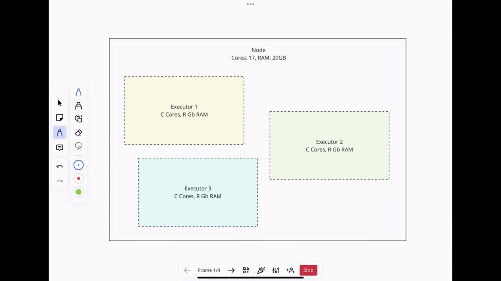

Executor tuning is crucial for optimizing Apache Spark performance. This guide covers the essential concepts of executor cores, memory allocation, and how to configure them effectively for your workloads.

**Key Learning Objectives:**
- Understand the relationship between executor cores and memory
- Learn how to calculate optimal executor configurations
- Master YARN resource management for Spark applications
- Avoid common pitfalls in executor tuning

---

## Understanding YARN Architecture

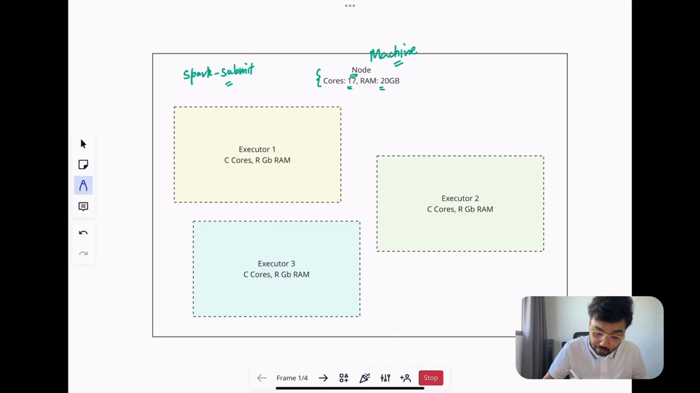

### YARN Components
- **ResourceManager**: Global resource manager
- **NodeManager**: Per-node framework agent
- **ApplicationMaster**: Per-application manager
- **Container**: Resource allocation unit

### Resource Allocation Flow
1. Application requests resources from ResourceManager
2. ResourceManager allocates containers on NodeManagers
3. ApplicationMaster manages container lifecycle
4. Executors run within allocated containers

---

## Key Configuration Parameters

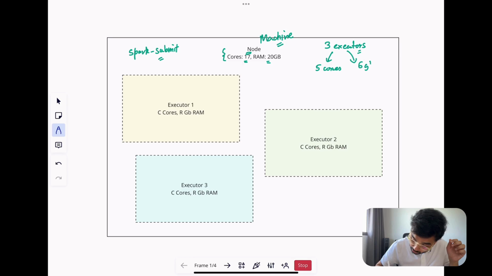

### Core Spark Parameters

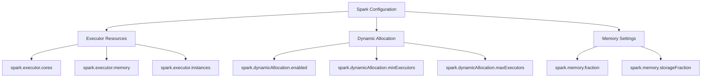

### Essential Parameters

| Parameter | Default | Description | Recommendation |
|-----------|---------|-------------|----------------|
| `spark.executor.cores` | 1 | Number of cores per executor | 4-5 cores |
| `spark.executor.memory` | 1g | Memory per executor | Based on workload |
| `spark.executor.instances` | 2 | Number of executors | Calculate based on resources |
| `spark.dynamicAllocation.enabled` | false | Enable dynamic allocation | true for production |
| `spark.shuffle.service.enabled` | false | Enable shuffle service | true for dynamic allocation |

---

## Executor Types: Fat vs Thin vs Optimal

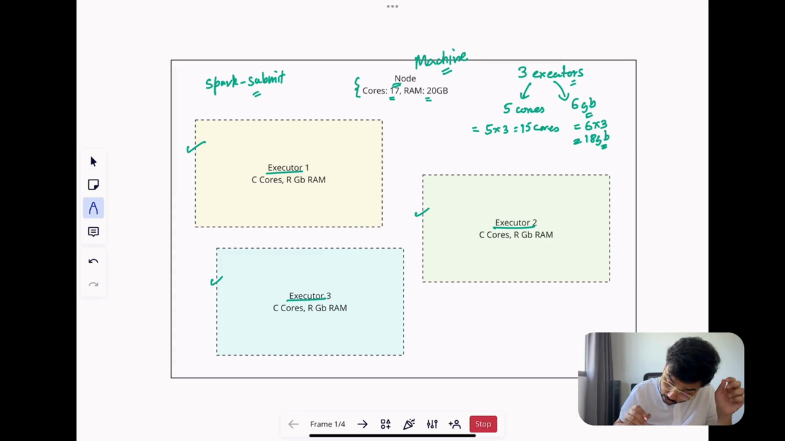

### 1. Fat Executors
- **Characteristics**: Many cores, high memory
- **Pros**: Better data locality, reduced network traffic
- **Cons**: Resource fragmentation, longer GC pauses
- **Use Case**: Large-scale batch processing

### 2. Thin Executors
- **Characteristics**: Few cores, low memory
- **Pros**: Better resource utilization, shorter GC pauses
- **Cons**: Increased network traffic, overhead
- **Use Case**: Interactive queries, streaming

### 3. Optimal Executors
- **Characteristics**: Balanced cores and memory
- **Pros**: Best of both worlds
- **Cons**: Requires careful calculation
- **Use Case**: General-purpose workloads

---

## Memory Allocation Strategies


### Memory Components

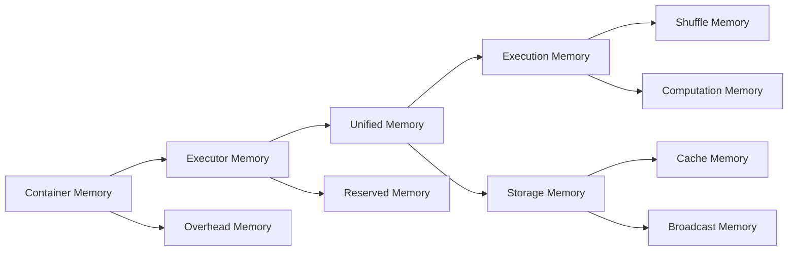

### Calculation Formulas

#### 1. Total Container Memory
```bash
Total Container Memory = Executor Memory + Overhead Memory
```

#### 2. Overhead Memory
```bash
Overhead Memory = max(384MB, Executor Memory × 0.1)
```

#### 3. Unified Memory
```bash
Unified Memory = Executor Memory × spark.memory.fraction (default: 0.6)
```

#### 4. Execution Memory
```bash
Execution Memory = Unified Memory × (1 - spark.memory.storageFraction)
```

---

## Performance Considerations

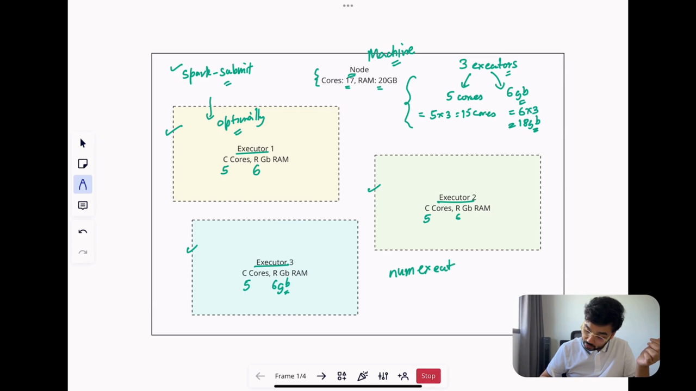

### 1. Garbage Collection Impact
- More memory per executor → Longer GC pauses
- Parallel GC helps with large heaps
- Consider G1GC for heaps > 4GB

### 2. Data Locality
- Fat executors improve data locality
- Reduce network shuffling
- Better HDFS throughput

### 3. Resource Utilization
- Avoid resource fragmentation
- Balance core and memory allocation
- Consider cluster size and workload

---

## Practical Examples

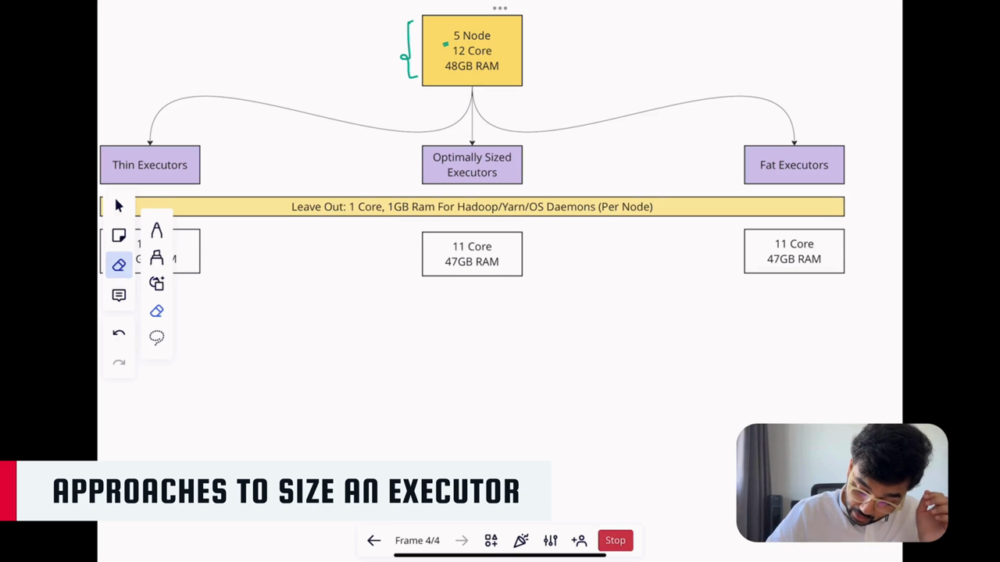

### Example 1: Small Cluster (16 cores, 64GB RAM)

```bash
# Configuration
--executor-cores 4 \
--executor-memory 8G \
--num-executors 3 \
--conf spark.dynamicAllocation.enabled=false
```

**Calculation:**
- Total executor memory: 3 × 8GB = 24GB
- Overhead memory: 3 × max(384MB, 8GB × 0.1) = 3 × 800MB = 2.4GB
- Total required: 24GB + 2.4GB = 26.4GB
- Cores used: 3 × 4 = 12 cores

### Example 2: Large Cluster (64 cores, 256GB RAM)

```bash
# Configuration
--executor-cores 5 \
--executor-memory 16G \
--num-executors 10 \
--conf spark.dynamicAllocation.enabled=true \
--conf spark.dynamicAllocation.minExecutors=5 \
--conf spark.dynamicAllocation.maxExecutors=15
```

**Calculation:**
- Total executor memory: 10 × 16GB = 160GB
- Overhead memory: 10 × max(384MB, 16GB × 0.1) = 10 × 1.6GB = 16GB
- Total required: 160GB + 16GB = 176GB
- Cores used: 10 × 5 = 50 cores

### Example 3: Streaming Workload

```bash
# Configuration
--executor-cores 2 \
--executor-memory 4G \
--num-executors 8 \
--conf spark.dynamicAllocation.enabled=true \
--conf spark.shuffle.service.enabled=true \
--conf spark.streaming.backpressure.enabled=true
```

---

## Best Practices


### 1. General Guidelines
- **Start with 4-5 cores per executor**
- **Balance memory and core allocation**
- **Enable dynamic allocation for production**
- **Monitor resource utilization**

### 2. Memory Settings
- **spark.memory.fraction**: 0.6-0.8 (default: 0.6)
- **spark.memory.storageFraction**: 0.4-0.6 (default: 0.5)
- **Leave 10-20% memory for system overhead**

### 3. Dynamic Allocation
- **Enable shuffle service**
- **Set appropriate min/max bounds**
- **Monitor executor allocation patterns**

### 4. Advanced Tuning
```bash
# Garbage Collection Tuning
--conf spark.executor.extraJavaOptions="-XX:+UseG1GC -XX:InitiatingHeapOccupancyPercent=35"

# Shuffle Optimization
--conf spark.shuffle.file.buffer=64k \
--conf spark.reducer.maxSizeInFlight=96m \
--conf spark.shuffle.io.maxRetries=3
```

### 5. Monitoring and Debugging
- Use Spark UI to monitor executor performance
- Check for GC pauses and memory pressure
- Monitor shuffle spill metrics
- Profile executor resource utilization

---

## Common Pitfalls and Solutions

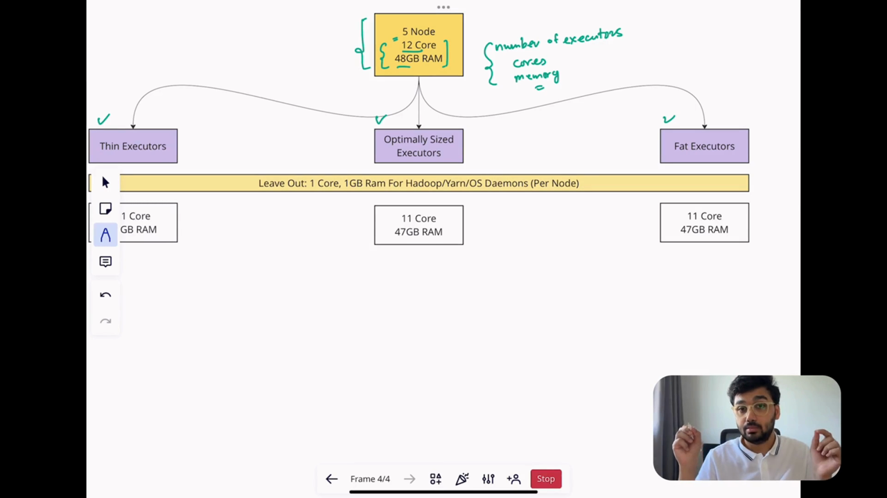

### 1. Out of Memory Errors
**Symptoms**: Executors dying with OOM
**Solutions**:
- Increase executor memory
- Reduce data partitioning
- Optimize memory settings
- Check for memory leaks

### 2. Resource Fragmentation
**Symptoms**: Poor cluster utilization
**Solutions**:
- Use dynamic allocation
- Optimize executor size
- Balance core/memory ratio

### 3. Long GC Pauses
**Symptoms**: Performance degradation
**Solutions**:
- Reduce executor memory
- Use parallel GC
- Consider G1GC
- Optimize memory settings

### 4. Network Issues
**Symptoms**: High shuffle times
**Solutions**:
- Increase executor cores
- Optimize data locality
- Tune shuffle parameters

---

## Advanced Configuration Examples

### Production-Grade Configuration

```bash
#!/bin/bash

# Production Spark Configuration
spark-submit \
  --class com.example.MySparkJob \
  --master yarn \
  --deploy-mode cluster \
  --executor-cores 4 \
  --executor-memory 12G \
  --num-executors 20 \
  --driver-memory 4G \
  --conf spark.dynamicAllocation.enabled=true \
  --conf spark.dynamicAllocation.minExecutors=10 \
  --conf spark.dynamicAllocation.maxExecutors=30 \
  --conf spark.shuffle.service.enabled=true \
  --conf spark.memory.fraction=0.7 \
  --conf spark.memory.storageFraction=0.4 \
  --conf spark.executor.extraJavaOptions="-XX:+UseG1GC -XX:InitiatingHeapOccupancyPercent=35" \
  --conf spark.sql.shuffle.partitions=200 \
  --conf spark.default.parallelism=400 \
  --conf spark.shuffle.file.buffer=64k \
  --conf spark.reducer.maxSizeInFlight=96m \
  my-app.jar \
  application-args
```

### Memory-Intensive Workload Configuration

```bash
#!/bin/bash

# Memory-Intensive Configuration
spark-submit \
  --class com.example.MemoryIntensiveJob \
  --master yarn \
  --deploy-mode cluster \
  --executor-cores 3 \
  --executor-memory 24G \
  --num-executors 8 \
  --driver-memory 8G \
  --conf spark.dynamicAllocation.enabled=false \
  --conf spark.memory.fraction=0.8 \
  --conf spark.memory.storageFraction=0.3 \
  --conf spark.executor.extraJavaOptions="-XX:+UseG1GC -XX:InitiatingHeapOccupancyPercent=35 -XX:MaxGCPauseMillis=200" \
  --conf spark.sql.inMemoryColumnarStorage.compressed=true \
  --conf spark.sql.inMemoryColumnarStorage.batchSize=10000 \
  my-app.jar \
  application-args
```

### Streaming Configuration

```bash
#!/bin/bash

# Streaming Configuration
spark-submit \
  --class com.example.StreamingJob \
  --master yarn \
  --deploy-mode cluster \
  --executor-cores 2 \
  --executor-memory 6G \
  --num-executors 12 \
  --driver-memory 4G \
  --conf spark.dynamicAllocation.enabled=true \
  --conf spark.dynamicAllocation.minExecutors=6 \
  --conf spark.dynamicAllocation.maxExecutors=20 \
  --conf spark.shuffle.service.enabled=true \
  --conf spark.streaming.backpressure.enabled=true \
  --conf spark.streaming.blockInterval=200ms \
  --conf spark.streaming.receiver.maxRate=10000 \
  --conf spark.executor.extraJavaOptions="-XX:+UseG1GC" \
  my-app.jar \
  application-args
```

---

## Performance Monitoring

### Key Metrics to Monitor

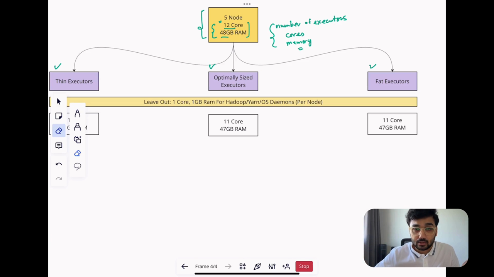

1. **Executor Metrics**
   - Active executors
   - Completed tasks
   - Shuffle read/write
   - GC time

2. **Memory Metrics**
   - Used memory
   - Available memory
   - Memory spills
   - Cache usage

3. **Resource Utilization**
   - CPU usage
   - Memory usage
   - Network I/O
   - Disk I/O

### Spark UI Monitoring

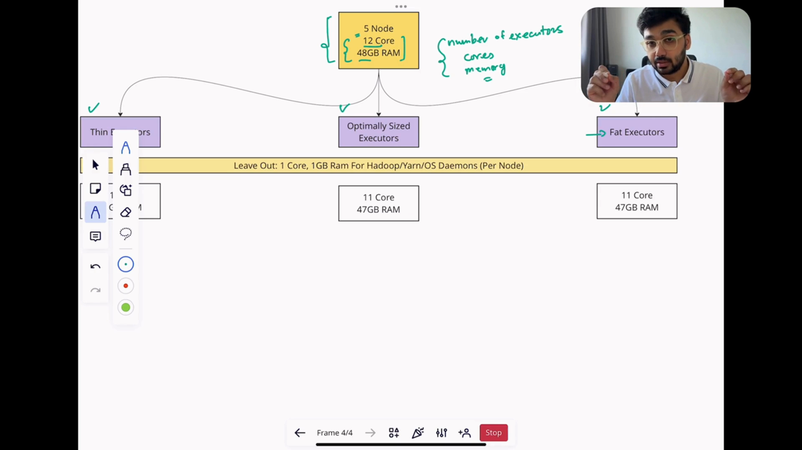

The Spark UI provides comprehensive monitoring capabilities:
- **Executors Tab**: Individual executor performance
- **Storage Tab**: Memory and cache usage
- **SQL Tab**: Query execution details
- **Jobs Tab**: Job progress and metrics

---

## Conclusion

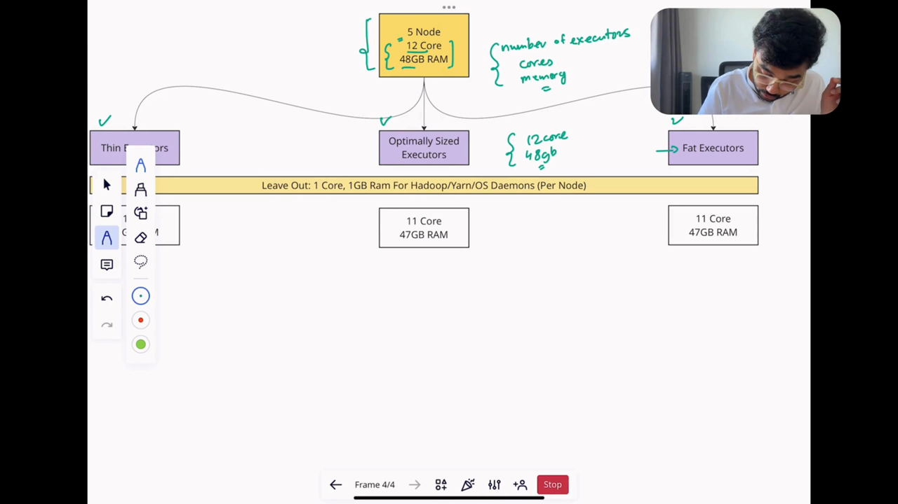

### Key Takeaways
1. **Balance is crucial**: Find the right balance between cores and memory
2. **Start conservative**: Begin with recommended settings and optimize
3. **Monitor continuously**: Use Spark UI and metrics for ongoing optimization
4. **Consider workload**: Different workloads require different configurations
5. **Use dynamic allocation**: Enable for production environments

### Final Recommendations
- **For general use**: 4-5 cores, 8-16GB memory per executor
- **For memory-intensive**: 3-4 cores, 16-32GB memory per executor
- **For streaming**: 2-3 cores, 4-8GB memory per executor
- **Always test**: Validate configurations with your specific workload

### Next Steps
1. Review your current Spark applications
2. Calculate optimal executor configurations
3. Implement monitoring and alerting
4. Continuously optimize based on metrics

---

## Advanced Shuffle Optimization

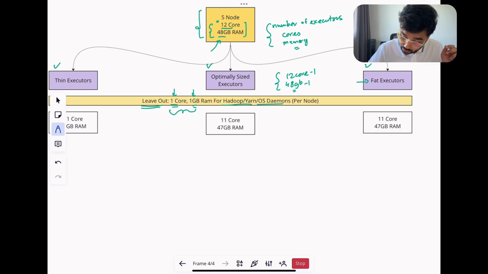

### Understanding Shuffle Performance
Shuffle operations are often the biggest performance bottleneck in Spark applications. Proper shuffle tuning is crucial for optimal performance.

### Key Shuffle Parameters

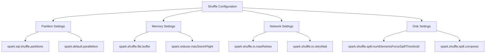

### Shuffle Partition Calculation

```bash
# Optimal shuffle partitions formula
Optimal Partitions = (Total Data Size / Target Partition Size)

# For memory-constrained environments
spark.sql.shuffle.partitions = 200  # Default
# For large datasets
spark.sql.shuffle.partitions = 1000 # For 100GB+ datasets

# For high-core clusters
spark.default.parallelism = (total_cores * 2)
```

### Shuffle Service Configuration

```bash
# Enable external shuffle service
--conf spark.shuffle.service.enabled=true \
--conf spark.shuffle.service.port=7337 \
--conf spark.shuffle.io.maxRetries=3 \
--conf spark.shuffle.io.retryWait=5s \
--conf spark.shuffle.io.connectionTimeout=60s
```

### Spill Management Strategies

```bash
# Reduce spilling to disk
--conf spark.shuffle.memoryFraction=0.2 \
--conf spark.shuffle.spill.numElementsForceSpillThreshold=1000000 \
--conf spark.shuffle.spill.compress=true \
--conf spark.shuffle.compress=true
```

---

## Advanced Memory Management

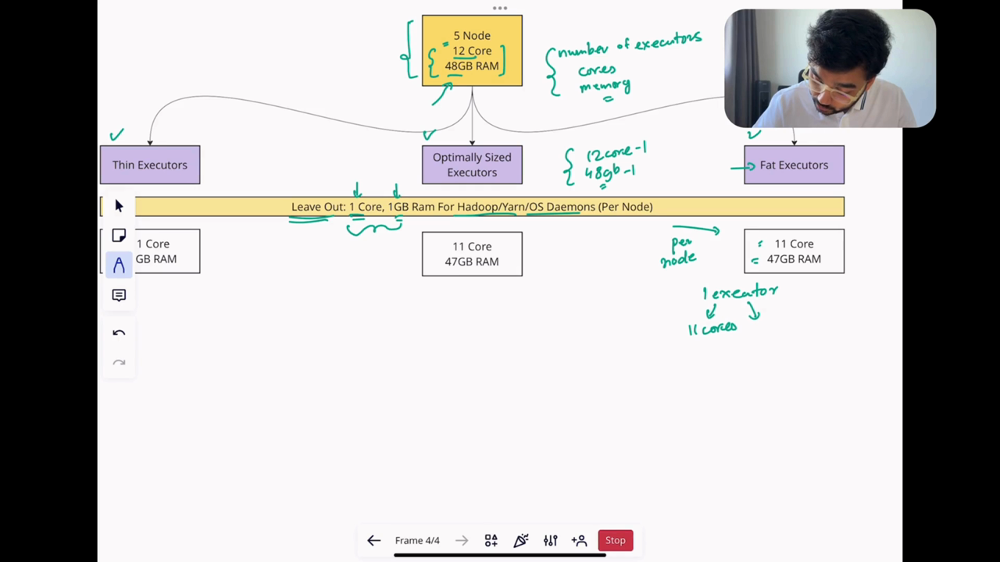

### Off-Heap Memory Configuration

Off-heap memory can help reduce GC pressure and improve performance for memory-intensive applications.

```bash
# Enable off-heap memory
--conf spark.memory.offHeap.enabled=true \
--conf spark.memory.offHeap.size=2g \
--conf spark.executor.memoryOverhead=1g
```

### Native Memory Allocation

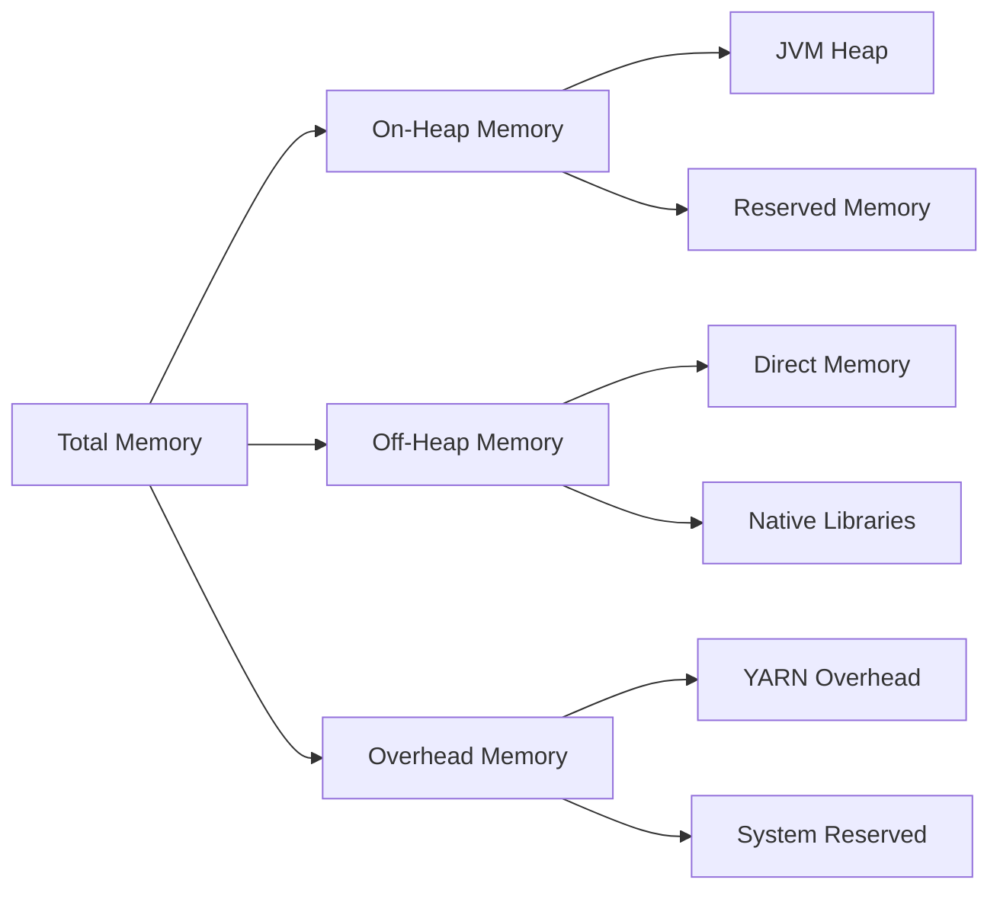

### Garbage Collection Tuning

```bash
# G1GC Configuration for large heaps
--conf spark.executor.extraJavaOptions="
-XX:+UseG1GC
-XX:InitiatingHeapOccupancyPercent=35
-XX:MaxGCPauseMillis=200
-XX:G1HeapRegionSize=32m
-XX:+UseStringDeduplication
-XX:ParallelGCThreads=4"

# Parallel GC for smaller heaps
--conf spark.executor.extraJavaOptions="
-XX:+UseParallelGC
-XX:ParallelGCThreads=4
-XX:+UseParallelOldGC"
```

### Memory Leak Detection

```bash
# Enable memory leak detection
--conf spark.executor.extraJavaOptions="
-XX:+HeapDumpOnOutOfMemoryError
-XX:HeapDumpPath=/tmp/heapdump.hprof
-XX:ErrorFile=/tmp/jvm_error.log"

# Monitor native memory
--conf spark.executor.extraJavaOptions="
-XX:NativeMemoryTracking=detail
-XX:+PrintNMTStatistics"
```

---

## Production Deployment Considerations

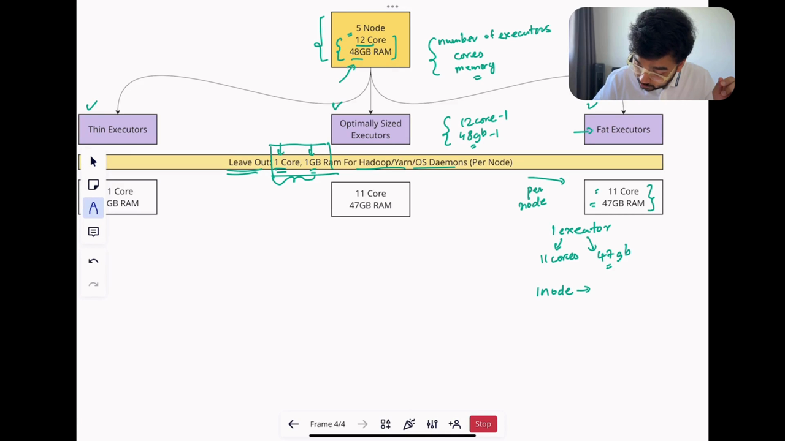

### Multi-tenant Environments

```bash
# Resource queue configuration
--conf spark.yarn.queue=production \
--conf spark.yarn.maxAppAttempts=1 \
--conf spark.yarn.am.memoryOverhead=512m \
--conf spark.yarn.executor.memoryOverhead=1g
```

### High Availability Configuration

```bash
# High availability settings
--conf spark.deploy.recoveryMode=ZOOKEEPER \
--conf spark.deploy.zookeeper.url=zk1:2181,zk2:2181,zk3:2181 \
--conf spark.deploy.zookeeper.dir=/spark \
--conf spark.blacklist.enabled=true \
--conf spark.blacklist.timeout=1h
```

### Resource Quotas and Limits

```bash
# Resource management
--conf spark.cores.max=100 \
--conf spark.maxResultSize=1g \
--conf spark.driver.maxResultSize=2g \
--conf spark.task.maxFailures=4 \
--conf spark.stage.maxConsecutiveAttempts=4
```

### Disaster Recovery Planning

```bash
# Checkpointing for recovery
--conf spark.checkpoint.dir=hdfs://checkpoint-dir \
--conf spark.checkpoint.interval=10m \
--conf spark.cleaner.referenceTracking.cleanCheckpoints=true
```

---

## Performance Benchmarking

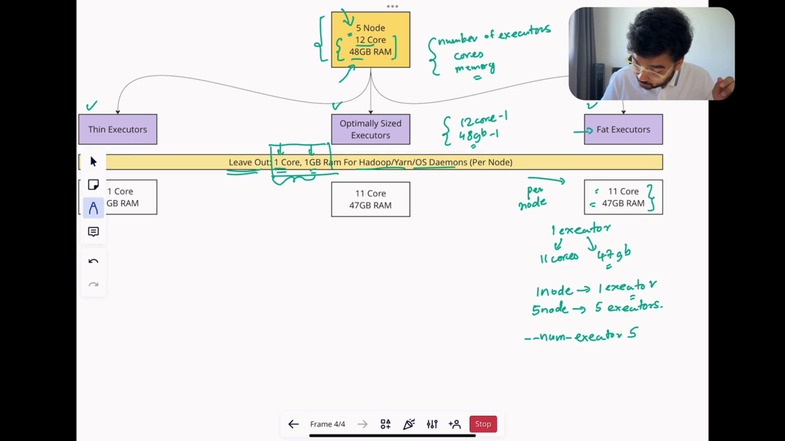

### Benchmark Methodology

1. **Establish Baseline**: Measure current performance metrics
2. **Identify Bottlenecks**: Use Spark UI and logs
3. **Test Incremental Changes**: Change one parameter at a time
4. **Measure Impact**: Compare before/after metrics
5. **Validate Stability**: Run multiple iterations

### Key Metrics to Track

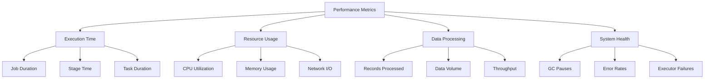

### Test Data Generation

```bash
# Generate test data
spark-submit --class org.apache.spark.examples.SparkPi \
  --master yarn \
  --executor-memory 1g \
  --num-executors 2 \
  --jars $SPARK_HOME/examples/jars/spark-examples*.jar \
  100

# TPC-DS benchmark setup
spark-sql --master yarn \
  --executor-memory 4g \
  --num-executors 10 \
  --conf spark.sql.shuffle.partitions=200 \
  --database tpcds \
  -f query1.sql
```

### Performance Regression Testing

```bash
# Automated performance testing
#!/bin/bash

# Test configurations
CONFIGS=(
  "--executor-cores 2 --executor-memory 4g --num-executors 5"
  "--executor-cores 4 --executor-memory 8g --num-executors 3"
  "--executor-cores 5 --executor-memory 12g --num-executors 2"
)

for config in "${CONFIGS[@]}"; do
  echo "Testing configuration: $config"
  time spark-submit $config my-app.jar
done
```

---

## Cloud Platform Configurations

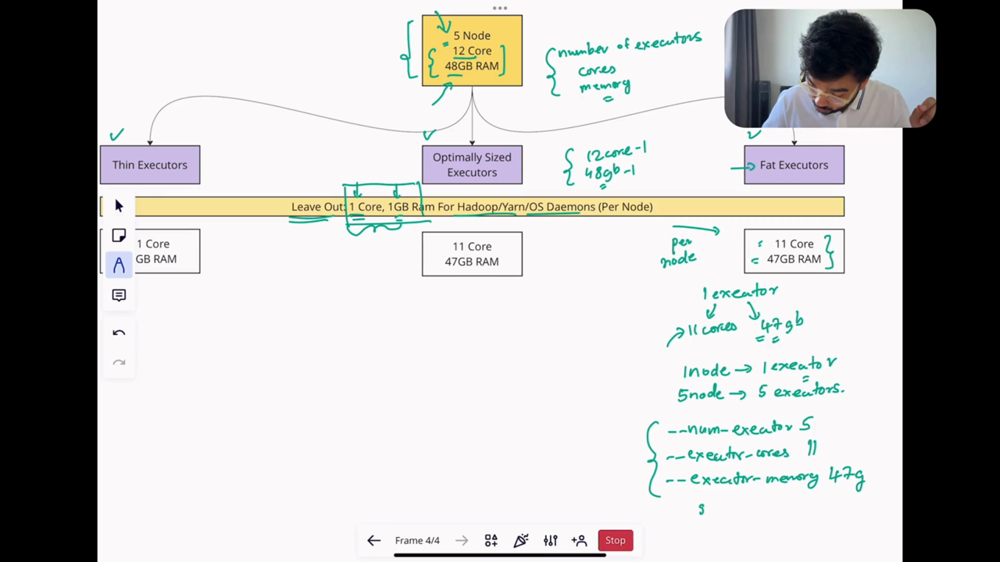

### AWS EMR Configuration

```bash
#!/bin/bash
# EMR optimized configuration
spark-submit \
  --master yarn \
  --deploy-mode cluster \
  --executor-cores 4 \
  --executor-memory 12g \
  --num-executors 10 \
  --driver-memory 4g \
  --conf spark.dynamicAllocation.enabled=true \
  --conf spark.dynamicAllocation.minExecutors=5 \
  --conf spark.dynamicAllocation.maxExecutors=20 \
  --conf spark.shuffle.service.enabled=true \
  --conf spark.serializer=org.apache.spark.serializer.KryoSerializer \
  --conf spark.sql.hive.metastorePartitionPruning=true \
  --conf spark.sql.files.maxPartitionBytes=134217728 \
  --conf spark.sql.files.openCostInBytes=4194304 \
  my-app.jar
```

### Databricks Configuration

```bash
#!/bin/bash
# Databricks optimized configuration
spark-submit \
  --master databricks \
  --executor-cores 4 \
  --executor-memory 16g \
  --num-executors 8 \
  --driver-memory 8g \
  --conf spark.databricks.clusterUsageTags.clusterAllPurposeId=your-cluster-id \
  --conf spark.databricks.delta.preview.enabled=true \
  --conf spark.databricks.io.cache.enabled=true \
  --conf spark.sql.adaptive.enabled=true \
  --conf spark.sql.adaptive.coalescePartitions.enabled=true \
  my-app.jar
```

### Google Cloud Dataproc Configuration

```bash
#!/bin/bash
# Dataproc optimized configuration
spark-submit \
  --master yarn \
  --deploy-mode cluster \
  --executor-cores 4 \
  --executor-memory 8g \
  --num-executors 8 \
  --driver-memory 4g \
  --conf spark.hadoop.fs.gs.project.id=your-project-id \
  --conf spark.hadoop.fs.gs.system.bucket=your-bucket \
  --conf spark.hadoop.google.cloud.auth.service.account.enable=true \
  --conf spark.hadoop.google.cloud.auth.service.account.json.keyfile=/path/to/key.json \
  --conf spark.dynamicAllocation.enabled=true \
  --conf spark.shuffle.service.enabled=true \
  my-app.jar
```

---

## Configuration Calculator

### Resource Allocation Calculator

```python
#!/usr/bin/env python3
"""
Spark Executor Configuration Calculator
"""

def calculate_executor_config(total_cores, total_memory_gb,
                           workload_type='general'):
    """
    Calculate optimal executor configuration based on cluster resources
    """

    # Workload-specific multipliers
    workload_multipliers = {
        'general': {'cores_per_executor': 4, 'memory_per_core': 2},
        'memory_intensive': {'cores_per_executor': 3, 'memory_per_core': 4},
        'cpu_intensive': {'cores_per_executor': 5, 'memory_per_core': 1.5},
        'streaming': {'cores_per_executor': 2, 'memory_per_core': 2}
    }

    multiplier = workload_multipliers.get(workload_type,
                                        workload_multipliers['general'])

    # Calculate optimal configuration
    cores_per_executor = multiplier['cores_per_executor']
    memory_per_executor = cores_per_executor * multiplier['memory_per_core']

    # Calculate number of executors
    max_executors_by_cores = int(total_cores / cores_per_executor)
    max_executors_by_memory = int(total_memory_gb / memory_per_executor)

    num_executors = min(max_executors_by_cores, max_executors_by_memory)

    # Reserve resources for driver and system
    num_executors = max(1, num_executors - 1)

    return {
        'num_executors': num_executors,
        'executor_cores': cores_per_executor,
        'executor_memory_gb': memory_per_executor,
        'total_cores_used': num_executors * cores_per_executor,
        'total_memory_used_gb': num_executors * memory_per_executor,
        'efficiency_cores': (num_executors * cores_per_executor) / total_cores * 100,
        'efficiency_memory': (num_executors * memory_per_executor) / total_memory_gb * 100
    }

# Example usage
if __name__ == "__main__":
    config = calculate_executor_config(
        total_cores=64,
        total_memory_gb=256,
        workload_type='general'
    )

    print("Recommended Configuration:")
    for key, value in config.items():
        print(f"  {key}: {value}")
```

### Memory Overhead Calculator

```python
def calculate_memory_overhead(executor_memory_gb):
    """
    Calculate memory overhead based on executor memory
    """
    # YARN overhead calculation
    overhead = max(0.384, executor_memory_gb * 0.1)
    container_memory = executor_memory_gb + overhead

    return {
        'executor_memory_gb': executor_memory_gb,
        'overhead_memory_gb': round(overhead, 2),
        'container_memory_gb': round(container_memory, 2),
        'overhead_percentage': round(overhead / container_memory * 100, 1)
    }
```

---

## Additional Resources

### Reference Materials
- [Spark Official Documentation](https://spark.apache.org/docs/latest/)
- [YARN Architecture Guide](https://hadoop.apache.org/docs/stable/hadoop-yarn/hadoop-yarn-site/YARN.html)
- [Spark Tuning Guide](https://spark.apache.org/docs/latest/tuning.html)
- [Spark Configuration Guide](https://spark.apache.org/docs/latest/configuration.html)

### Tools and Utilities
- Spark UI for monitoring
- YARN ResourceManager UI
- Cluster resource calculators
- Performance benchmarking tools
- [Spark-Submit Calculator](https://spark-calculator.herokuapp.com/)

### Community Resources
- Spark mailing lists
- Stack Overflow
- Apache Spark JIRA
- Performance tuning blogs and articles
- [Spark Performance Blog](https://databricks.com/blog/category/engineering/apache-spark)

### Books and Courses
- "High Performance Spark" by Holden Karau and Andy Konwinski
- "Spark: The Definitive Guide" by Bill Chambers and Matei Zaharia
- Databricks Academy courses
- Cloudera Spark training

---

**Note**: This guide provides comprehensive coverage of Apache Spark executor tuning concepts. Always test configurations in your specific environment and adjust based on your workload characteristics and cluster resources. Use the configuration calculator as a starting point and fine-tune based on actual performance metrics.