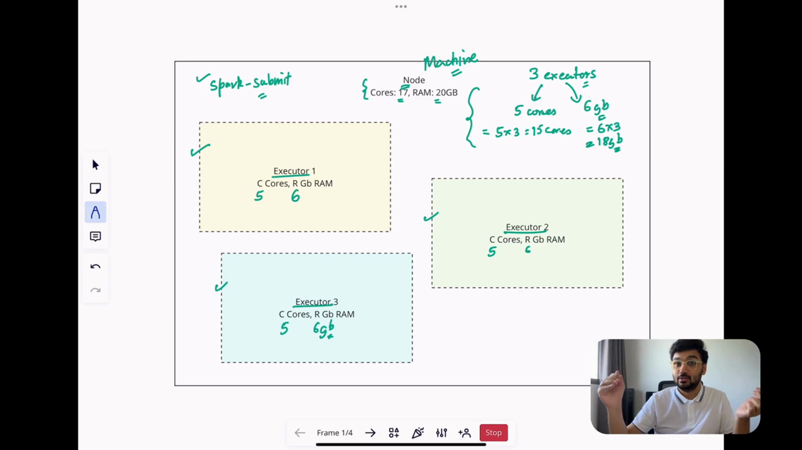
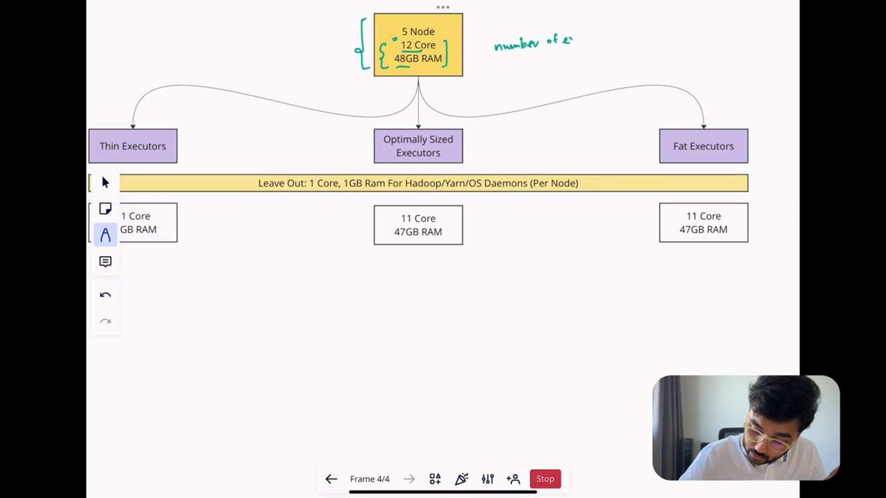

# Apache Spark Executor Tuning | Executor Cores & Memory - Complete Guide


## Table of Contents
1. [Introduction to Executor Tuning](#introduction-to-executor-tuning)
2. [Understanding Executors in Cluster Nodes](#understanding-executors-in-cluster-nodes)
3. [Fat vs Thin Executors](#fat-vs-thin-executors)
4. [Four Rules for Optimal Executor Sizing](#four-rules-for-optimal-executor-sizing)
5. [Optimal Executor Calculation - Example 1](#optimal-executor-calculation---example-1)
6. [Optimal Executor Calculation - Example 2](#optimal-executor-calculation---example-2)
7. [Memory Per Core Consideration](#memory-per-core-consideration)
8. [Benefits of Optimal Executors](#benefits-of-optimal-executors)
9. [Summary](#summary)

---

## Introduction to Executor Tuning


Even if you've written the best-in-class Spark code, your jobs may take forever to complete if you haven't done the allocation of CPU and memory resources correctly. This guide covers the essential methodology for deciding:

- Number of executors to create
- Amount of memory to allocate per executor
- Number of cores to assign per executor

**Key Learning Objectives:**
- Understand how executors are created and allocated in cluster nodes
- Learn the differences between fat, thin, and optimal executors
- Master the four rules for optimal executor sizing
- Practice with real calculation examples

---

## Understanding Executors in Cluster Nodes


### What is a Cluster Node?
A cluster node is one machine in a cluster. You could have several of these machines, each with their own CPU and memory configurations.

### Executor Creation Process
When you run `spark-submit`, you specify:
- Number of executors to create
- Amount of cores per executor
- Amount of memory per executor

### Example: Single Node Configuration
Let's consider a node with:
- **17 cores**
- **20 GB RAM**

If we create 3 executors with:
- **5 cores each**
- **6 GB RAM each**

Total resource usage:
- **Cores**: 5 × 3 = 15 cores
- **Memory**: 6 GB × 3 = 18 GB RAM


---

## Fat vs Thin Executors


When sizing executors, you have three options:
1. **Fat Executors** - Occupy large portion of node resources
2. **Thin Executors** - Occupy minimal resources
3. **Optimal Executors** - Balanced resource allocation

### Example Cluster Configuration
Let's use a consistent example:
- **5 nodes**
- **12 cores per node** (total 60 cores)
- **48 GB RAM per node** (total 240 GB RAM)

---

### Fat Executors


Fat executors occupy a large portion of resources on a node.

#### Calculation Steps:

1. **Leave resources for OS/Hadoop (per node):**
   - Subtract 1 core: 12 - 1 = **11 cores available**
   - Subtract 1 GB RAM: 48 - 1 = **47 GB RAM available**

2. **Create one fat executor per node:**
   - **Cores per executor**: 11 cores
   - **Memory per executor**: 47 GB RAM
   - **Executors per node**: 1

3. **Cluster-wide configuration:**
   - **Total executors**: 5 nodes × 1 = **5 executors**
   - **Executor cores**: 11 cores
   - **Executor memory**: 47 GB

#### Spark Submit Configuration:
```bash
spark-submit \
  --num-executors 5 \
  --executor-cores 11 \
  --executor-memory 47g \
  your-application.jar
```

#### Advantages of Fat Executors:
1. **Increased Task Parallelism**: Many cores can run many tasks simultaneously
2. **Memory-Intensive Tasks**: Can handle tasks requiring significant memory
3. **Reduced Management Overhead**: Fewer executors to manage
4. **Enhanced Data Locality**: Large memory can hold more partitions locally
5. **Reduced Network Traffic**: Less data shuffling across cluster
6. **Improved Application Speed**: Due to better data locality

#### Disadvantages of Fat Executors:
1. **Resource Waste**: Risk of paying for idle resources
2. **Fault Tolerance Issues**: Executor failure loses large amounts of computed work
3. **HDFS Throughput Problems**: More than 5 cores causes excessive garbage collection
4. **Longer GC Pauses**: Large heap sizes lead to longer garbage collection pauses

---

### Thin Executors



Thin executors occupy minimal resources on a node.

#### Calculation Steps:

1. **Leave resources for OS/Hadoop (per node):**
   - **11 cores available** (12 - 1)
   - **47 GB RAM available** (48 - 1)

2. **Create minimal executors:**
   - **Cores per executor**: 1 core
   - **Memory per executor**: 47 GB ÷ 11 executors = **4 GB RAM**
   - **Executors per node**: 11

3. **Cluster-wide configuration:**
   - **Total executors**: 5 nodes × 11 = **55 executors**
   - **Executor cores**: 1 core
   - **Executor memory**: 4 GB

#### Spark Submit Configuration:
```bash
spark-submit \
  --num-executors 55 \
  --executor-cores 1 \
  --executor-memory 4g \
  your-application.jar
```

#### Advantages of Thin Executors:
1. **Executor-Level Parallelism**: Many executors can work simultaneously
2. **Better Fault Tolerance**: Losing one executor loses minimal work
3. **Suitable for Lightweight Jobs**: Good for small, independent tasks

#### Disadvantages of Thin Executors:
1. **High Network Traffic**: Small memory causes frequent data shuffling
2. **Reduced Data Locality**: Limited memory holds fewer partitions locally
3. **Management Overhead**: Many executors to manage and coordinate

---

## Four Rules for Optimal Executor Sizing


To create optimal executors, follow these four essential rules:

### Rule 1: Leave Resources for OS/Hadoop
**Per node, subtract:**
- **1 core** for Hadoop, YARN, and operating system processes
- **1 GB RAM** for system processes

### Rule 2: Leave Resources for Application Master
**At cluster level, choose one:**
- **Option A**: Subtract 1 executor (simple but wasteful for fat executors)
- **Option B**: Subtract 1 core and 1 GB RAM (more efficient)

**Note**: Application Master negotiates resources with ResourceManager and typically needs only 1 core and 1 GB RAM.

### Rule 3: 3 to 5 Cores per Executor
- **Recommended**: 3-5 cores per executor
- **Reason**: More than 5 cores degrades HDFS throughput due to excessive garbage collection
- **Balance**: Avoids both GC pauses and underutilization

### Rule 4: Exclude Memory Overhead
**Executor memory should exclude overhead memory:**
- **Overhead Calculation**: `max(384 MB, 10% of executor memory)`
- **Actual Memory**: `Executor Memory - Overhead Memory`

---

## Optimal Executor Calculation - Example 1


### Cluster Configuration:
- **5 nodes**
- **12 cores per node** (total 60 cores)
- **48 GB RAM per node** (total 240 GB RAM)

### Step-by-Step Calculation:

#### Step 1: Apply Rule 1 (Per Node)
```
Per Node:
  Cores: 12 - 1 = 11 cores available
  RAM: 48 - 1 = 47 GB available
```

#### Step 2: Calculate Total Cluster Resources
```
Total Cores: 11 cores/node × 5 nodes = 55 cores
Total RAM: 47 GB/node × 5 nodes = 235 GB
```

#### Step 3: Apply Rule 2 (Application Master)
```
Using Option B (1 core + 1 GB RAM):
  Available Cores: 55 - 1 = 54 cores
  Available RAM: 235 - 1 = 234 GB
```

#### Step 4: Apply Rule 3 (Cores per Executor)
```
Choose 5 cores per executor (within 3-5 range):
  Total Executors: 54 cores ÷ 5 cores/executor = 10.8 → 10 executors
  Actual Cores Used: 10 executors × 5 cores = 50 cores
  Cores Remaining: 54 - 50 = 4 cores (unused but acceptable)
```

#### Step 5: Calculate Memory per Executor
```
Memory per Executor: 234 GB ÷ 10 executors = 23.4 GB
```

#### Step 6: Apply Rule 4 (Memory Overhead)
```
Overhead: max(384 MB, 10% of 23.4 GB) = max(384 MB, 2.34 GB) = 2.34 GB
Actual Memory: 23.4 GB - 2.34 GB = 21.06 GB → 20 GB (rounded down)
```

### Final Configuration:
```bash
spark-submit \
  --num-executors 10 \
  --executor-cores 5 \
  --executor-memory 20g \
  your-application.jar
```

### Memory Per Core Analysis:
```
Memory per Core: 20 GB ÷ 5 cores = 4 GB per core
```
**Implication**: Each core (and therefore each partition) can process up to 4 GB of data efficiently.

---

## Optimal Executor Calculation - Example 2



### Cluster Configuration:
- **3 nodes**
- **16 cores per node** (total 48 cores)
- **48 GB RAM per node** (total 144 GB RAM)

### Step-by-Step Calculation:

#### Step 1: Apply Rule 1 (Per Node)
```
Per Node:
  Cores: 16 - 1 = 15 cores available
  RAM: 48 - 1 = 47 GB available
```

#### Step 2: Calculate Total Cluster Resources
```
Total Cores: 15 cores/node × 3 nodes = 45 cores
Total RAM: 47 GB/node × 3 nodes = 141 GB
```

#### Step 3: Apply Rule 2 (Application Master)
```
Using Option B (1 core + 1 GB RAM):
  Available Cores: 45 - 1 = 44 cores
  Available RAM: 141 - 1 = 140 GB
```

#### Step 4: Apply Rule 3 (Cores per Executor)
```
Choose 4 cores per executor (within 3-5 range):
  Total Executors: 44 cores ÷ 4 cores/executor = 11 executors
  Actual Cores Used: 11 executors × 4 cores = 44 cores
  Cores Remaining: 44 - 44 = 0 cores (perfect utilization)
```

#### Step 5: Calculate Memory per Executor
```
Memory per Executor: 140 GB ÷ 11 executors = 12.72 GB
```

#### Step 6: Apply Rule 4 (Memory Overhead)
```
Overhead: max(384 MB, 10% of 12.72 GB) = max(384 MB, 1.27 GB) = 1.27 GB
Actual Memory: 12.72 GB - 1.27 GB = 11.45 GB → 11 GB (rounded down)
```

### Final Configuration:
```bash
spark-submit \
  --num-executors 11 \
  --executor-cores 4 \
  --executor-memory 11g \
  your-application.jar
```

### Memory Per Core Analysis:
```
Memory per Core: 11 GB ÷ 4 cores = 2.75 GB per core
```
**Implication**: Each core can process up to 2.75 GB of data efficiently.

---

## Memory Per Core Consideration


### Why Memory Per Core Matters

The **memory per core** ratio is crucial because:
- **One core processes one partition at a time**
- **Memory per core = maximum data per partition**
- **Partition size should be ≤ memory per core**

### Calculation Formula:
```
Memory Per Core = Executor Memory ÷ Executor Cores
```

### Examples from Our Calculations:

#### Example 1:
```
Memory Per Core = 20 GB ÷ 5 cores = 4 GB per core
```
- **Suitable for**: Partitions up to 4 GB
- **Typical partition sizes**: 128 MB, 256 MB, 512 MB, 1 GB
- **Assessment**: Excellent for most workloads

#### Example 2:
```
Memory Per Core = 11 GB ÷ 4 cores = 2.75 GB per core
```
- **Suitable for**: Partitions up to 2.75 GB
- **Assessment**: Good for medium-sized partitions

### Impact of Partition Size:

| Partition Size | Example 1 (4 GB/core) | Example 2 (2.75 GB/core) |
|----------------|----------------------|--------------------------|
| 128 MB | ✅ Excellent | ✅ Excellent |
| 256 MB | ✅ Excellent | ✅ Excellent |
| 512 MB | ✅ Excellent | ✅ Excellent |
| 1 GB | ✅ Excellent | ✅ Excellent |
| 2 GB | ✅ Excellent | ✅ Good |
| 4 GB | ✅ Good | ❌ Too Large |
| 8 GB | ❌ Too Large | ❌ Too Large |

### Key Insight:
**Your cluster configuration should be based on your partition size, not total data size.**

Whether you're processing 10 GB or 100 GB of data, what matters is:
- How is your data partitioned?
- What is the size of each partition?
- Can each core handle the partition size with its allocated memory?

---

## Benefits of Optimal Executors


### 1. Balanced Resource Utilization
- **Not too low**: Avoids the overhead of thin executors
- **Not too high**: Avoids resource waste of fat executors
- **Sweet spot**: 3-5 cores per executor provides optimal balance

### 2. Good Parallelism
- **Task-level**: Multiple cores per executor enable parallel task execution
- **Executor-level**: Multiple executors enable parallel processing across nodes
- **Optimal scaling**: Balances intra-executor and inter-executor parallelism

### 3. Healthy HDFS Throughput
- **GC Control**: 3-5 cores per executor prevents excessive garbage collection
- **Stable Performance**: Avoids the long GC pauses that plague fat executors
- **Predictable Behavior**: Consistent HDFS read/write performance

### 4. Enhanced Data Locality
- **Adequate Memory**: 20 GB (Example 1) or 11 GB (Example 2) can hold many partitions
- **Reduced Shuffling**: Local data processing minimizes network traffic
- **Performance**: Less data movement across the cluster improves speed

### 5. Efficient Resource Usage
- **Minimal Waste**: Near-perfect core utilization (50/54 in Example 1, 44/44 in Example 2)
- **Cost-Effective**: Pay for what you use, not idle resources
- **Scalable**: Configuration scales well with cluster size

### 6. Fault Tolerance Balance
- **Granular Enough**: Executor failure doesn't lose excessive work
- **Not Too Granular**: Avoids the management overhead of many small executors
- **Recovery Time**: Balanced recomputation overhead on failures

---

## Summary


### Key Takeaways

1. **Three Executor Types**:
   - **Fat Executors**: Large resource allocation per executor (11+ cores)
   - **Thin Executors**: Minimal resource allocation per executor (1 core)
   - **Optimal Executors**: Balanced allocation (3-5 cores)

2. **Four Golden Rules**:
   - **Rule 1**: Leave 1 core + 1 GB RAM per node for OS/Hadoop
   - **Rule 2**: Leave 1 core + 1 GB RAM for Application Master
   - **Rule 3**: Use 3-5 cores per executor
   - **Rule 4**: Exclude memory overhead (max of 384 MB or 10%)

3. **Calculation Methodology**:
   - Start with per-node resources
   - Apply OS/Hadoop deductions
   - Calculate cluster-wide totals
   - Apply Application Master deductions
   - Determine executor count based on cores per executor
   - Calculate memory per executor
   - Subtract memory overhead

4. **Memory Per Core Insight**:
   - Focus on partition size, not total data size
   - Ensure memory per core ≥ typical partition size
   - This determines your effective processing capacity

### Practical Application

When configuring your Spark jobs:

1. **Know Your Cluster**: Understand nodes, cores, and memory
2. **Know Your Data**: Understand partition sizes and requirements
3. **Follow the Rules**: Apply the four rules systematically
4. **Calculate Carefully**: Use the step-by-step methodology
5. **Monitor and Adjust**: Observe performance and fine-tune as needed

### Final Configuration Examples

#### For Large Clusters (Example 1):
```bash
spark-submit \
  --num-executors 10 \
  --executor-cores 5 \
  --executor-memory 20g \
  your-application.jar
```

#### For Medium Clusters (Example 2):
```bash
spark-submit \
  --num-executors 11 \
  --executor-cores 4 \
  --executor-memory 11g \
  your-application.jar
```

### Remember:
- **Optimal executors balance all considerations**
- **Memory per core determines your partition handling capacity**
- **Always consider your specific workload requirements**
- **Test and validate configurations in your environment**

By following this systematic approach to executor sizing, you can ensure that your Spark jobs run efficiently and make the best use of your cluster resources.

---

**Note**: This guide provides a comprehensive methodology for Spark executor tuning based on the video content. Always test your configurations in your specific environment and adjust based on your workload characteristics and cluster resources.