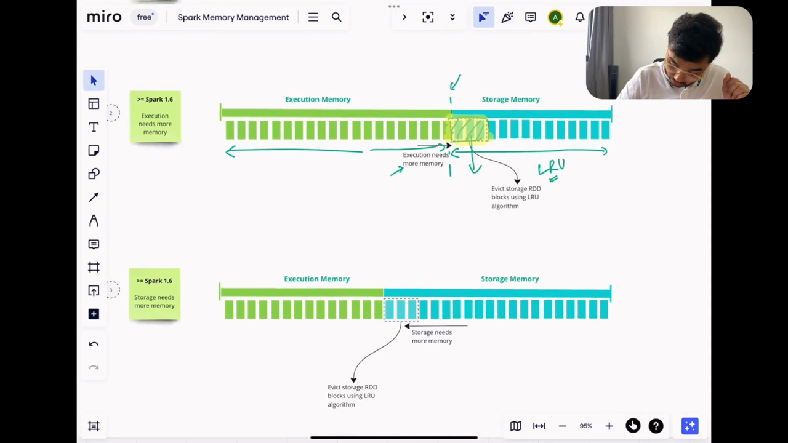
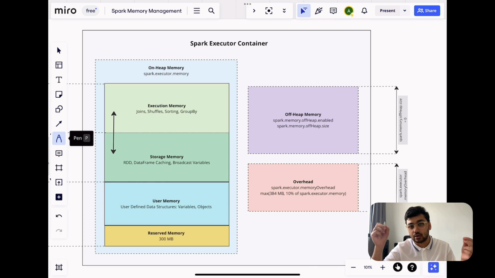

# Apache Spark Memory Management - Complete Visual Guide

**Based on YouTube Video: https://www.youtube.com/watch?v=sXL1qgrPysg**

This comprehensive guide covers Apache Spark Memory Management with detailed explanations, visual diagrams, and practical examples. Each section includes screenshot descriptions from the video to provide complete understanding.

## Table of Contents
1. [Introduction to Memory Management](#introduction-to-memory-management)
2. [Executor Memory Layout](#executor-memory-layout)
3. [Memory Calculations and Examples](#memory-calculations-and-examples)
4. [Unified Memory Management](#unified-memory-management)
5. [Memory Slider Rules and Priority](#memory-slider-rules-and-priority)
6. [Off-Heap Memory](#off-heap-memory)
7. [Garbage Collection and Performance](#garbage-collection-and-performance)
8. [Practical Configuration Examples](#practical-configuration-examples)
9. [Best Practices and Common Mistakes](#best-practices-and-common-mistakes)

---

## Introduction to Memory Management

### 📹 [Screenshot: Video Title and Introduction - 00:00]

*Visual: Video title "Apache Spark Memory Management" with presenter introduction*

**Quote from Video (00:00-00:44):**
> "Do you know that understanding memory management can help you solve a wide variety of optimization problems in spark? So memory management has been a crucial topic, a tricky topic for most of us to understand, but at the same time it is very important in order to develop a solid grasp over two things: the first one is how spark Works in and the second one is which portion of the memory is responsible for storing what."

### Why Memory Management Matters

Understanding Spark memory management helps you:
- Solve optimization problems effectively
- Understand how Spark works internally
- Know which memory portion stores what data
- Configure Spark applications for optimal performance
- Debug memory-related issues

### Topics Covered in This Guide

According to the video (00:44), we'll cover three main topics:
1. **Executor Memory Management** - How memory is organized within executors
2. **Unified Memory** - What it is and why it's called "unified"
3. **Off-Heap Memory** - The least talked about but useful memory type

---

## Executor Memory Layout

### 📹 [Screenshot: Spark Executor Container Diagram - 01:24]

*Visual: Large container showing "Spark Executor" with three main memory sections*

**Quote from Video (01:24):**
> "So we are going to talk about these three topics in the video... so here we have a spark executor container and we see that there are three major components of memory right: the first one is the on Heap memory which occupies the largest block over here, the other one is the off Heap memory which is this one and the last one is the overhead memory."

### Memory Components Overview


### On-Heap Memory Details

### 📹 [Screenshot: On-Heap Memory Breakdown - 02:51]

*Visual: Detailed breakdown of on-heap memory showing the four sections*

**Quote from Video (02:51):**
> "So the on Heap memory is divided into four sections right: the first one is execution memory, execution memory is the place where your joins shuffles sorts and aggregations happen right... the other one is the storage memory, the storage memory is the place where your caching happen right and this caching can be either rdd or data frame caching right and it's also used for storing broadcast variables."

#### 1. Execution Memory
- **Purpose**: Joins, shuffles, sorts, and aggregations
- **Critical for**: All major Spark operations
- **Managed by**: Spark's memory manager

#### 2. Storage Memory
- **Purpose**: Caching (RDD/DataFrame), broadcast variables
- **Usage**: `.cache()`, `.persist()`, broadcast joins
- **Eviction**: LRU-based when memory is needed

#### 3. User Memory
- **Purpose**: User objects, variables, collections, UDFs
- **Examples**: Lists, sets, dictionaries in your code
- **Managed by**: User code

#### 4. Reserved Memory
- **Purpose**: Spark internal operations
- **Usage**: System-level operations, internal objects
- **Fixed size**: 300MB by default

### JVM's Role in Memory Management

### 📹 [Screenshot: JVM and Spark Relationship - 01:53]

*Visual: Diagram showing JVM as execution environment for Spark*

**Quote from Video (01:53-02:51):**
> "An important point to note is that most of Sparks operation is run on the on Heap memory which is managed by the jvm... the jvm stands for Java virtual machine and it's like a virtual computer that is used for running Java programs so spark is written in Scala which runs on the jvm... when you're writing code in Python using py spark you're basically using a wrapper around Java apis of spark... the underlying execution that happens is still going to happen on the jvm."

---

## Memory Calculations and Examples

### 📹 [Screenshot: 10GB Executor Memory Example - 05:05]

*Visual: Container with 10GB executor memory and mathematical calculations*

**Quote from Video (05:05):**
> "So let's take an example to understand which portion of the memory is going to occupy how much of space... let me quickly remove all of this and let's assume that when we ran our spark jobs we pathfi the executor memory 10 GB right so basically essentially this value that we' specified spark.executor.do memory we specified it to be 10 GB right."

### Key Configuration Parameters

1. **`spark.executor.memory`**: Total executor memory (e.g., 10GB)
2. **`spark.memory.fraction`**: Portion for unified memory (default: 0.6)
3. **`spark.memory.storageFraction`**: Portion for storage within unified memory (default: 0.5)

### Step-by-Step Calculation Example

#### Given: 10GB Executor Memory

**Step 1: Calculate Unified Memory**
```
Unified Memory = spark.executor.memory × spark.memory.fraction
                 = 10GB × 0.6 = 6GB
```

### 📹 [Screenshot: 6GB Unified Memory Calculation - 05:54]

*Visual: Container showing 6GB total unified memory*

**Quote from Video (05:54):**
> "Now there is a value which is called spark.memory.fraction and that defines how much of space this execution memory is going to take from here to here right and that is simply 0.6 of the total value 0.6 of 10 so is going to be 6 into 10 GB which is 6 GB yeah so this whole portion from here to here is going to be 6 GB."

**Step 2: Calculate Storage Memory**
```
Storage Memory = Unified Memory × spark.memory.storageFraction
                 = 6GB × 0.5 = 3GB
```

**Step 3: Calculate Execution Memory**
```
Execution Memory = Unified Memory - Storage Memory
                   = 6GB - 3GB = 3GB
```

### 📹 [Screenshot: 3GB Storage and 3GB Execution Memory - 06:51]

*Visual: Container showing 3GB each for storage and execution memory*

**Quote from Video (06:51):**
> "And this can be adjusted based on needs but the default is 0.5 so that would simply mean half of 6 G GB which is going to be 3 GB yeah and this is going to be 3 GB because 6 GB minus 3 GB... so the remaining is 6 GB minus 3 GB which is 3 GB yeah."

**Step 4: Calculate User Memory**
```
Total Non-Unified = Executor Memory - Unified Memory
                   = 10GB - 6GB = 4GB

User Memory = Total Non-Unified - Reserved Memory
             = 4GB - 300MB = 3.7GB (assuming 1GB = 1000MB)
```

### 📹 [Screenshot: 3.7GB User Memory Calculation - 07:55]

*Visual: Final memory layout with all portions labeled*

**Quote from Video (07:55):**
> "This portion this whole portion is 10 GB minus 6 GB because 6 GB was this portion right so this is going to be 4 GB this whole portion and to calculate the value only for this one you just have to do 4 gbes minus 4 GB - 300 MB which is 3.7 GB."

### Complete Memory Layout for 10GB Executor


### Overhead Memory Calculation

### 📹 [Screenshot: Overhead Memory Calculation - 08:53]

*Visual: Diagram showing overhead memory calculation*

**Quote from Video (08:53):**
> "So if we wanted to calculate the overhead memory the overhead memory is simply defined by maximum of 384 or 10% of spark executed memory so spark executor memory is 10 GB 10% of it is going to be 1 GB maximum of 384 and 1 GB 384 MB or 1 GB and this is going to be 1 GB so your overhead is going to be 1 gbyte."

```
Overhead Memory = max(384MB, 10% of spark.executor.memory)
                 = max(384MB, 10% of 10GB)
                 = max(384MB, 1GB)
                 = 1GB
```

### Off-Heap Memory Configuration

### 📹 [Screenshot: Off-Heap Memory Section - 09:44]

*Visual: Off-heap memory section with execution and storage components*

**Quote from Video (09:44):**
> "And coming to the off Heap memory the off Heap m memory is disabled by default so you see that this parameter over here is set to zero you can of course set it to a nonzero number and basically let's say allocate memory over here but the way off Heap memory is structured this also has two parts the first one is execution and the second one is storage so it looks looks the same as this one as unified memory."

**Total Container Memory Request:**
```
Total Memory = Executor Memory + Overhead Memory + Off-Heap Memory
             = 10GB + 1GB + 0GB (disabled by default)
             = 11GB
```

### 📹 [Screenshot: Total Memory Request Calculation - 11:20]

*Visual: Container showing 11GB total memory request to cluster manager*

**Quote from Video (11:20):**
> "So when spark request the cluster manag such as the Yan for memory what it is going to do is that it is going to add the executor memory and the overhead and if off memory is dis uh enabled it is going to add that and then it is going to request for memory so in this case I assume that off memory is disabled overhead is 1 GB executor memory is 10 GB so it is going to request the cluster manager for 11 GB of data for this container."

---

## Unified Memory Management

### 📹 [Screenshot: Unified Memory Concept Introduction - 12:03]

*Visual: Unified memory section with execution and storage combined*

**Quote from Video (12:03):**
> "So now we are going to talk about unified memory and this portion of the memory the execution and the storage memory together is called the unified memory as we've seen earlier as well right and the reason why storage and execution together is called unified is because of dynamic memory management strategy of spark."

### What is Unified Memory?

**Unified Memory** refers to the combination of:
- **Execution Memory** + **Storage Memory**
- **Dynamic Memory Management**: Memory can be borrowed between the two
- **Efficient Resource Utilization**: No fixed boundaries prevent memory waste

### Why "Unified"?

The term "unified" comes from the dynamic memory management strategy introduced in Spark 1.6+:

### 📹 [Screenshot: Pre vs Post Spark 1.6 Comparison - 13:17]

*Visual: Side-by-side comparison of fixed vs dynamic memory allocation*

**Quote from Video (13:17):**
> "I wanted to talk a little bit about how the scenario was before spark 1.6 and after spark 1.6 so before spark 1.6 let's assume that this whole Space is for the unified memory is for the unified memory and what we see over here is that the space that was given to execution and storage memory was fixed so this was fixed right the bar was not movable you cannot move here and there."

### Before Spark 1.6 (Fixed Memory Allocation)

- **Fixed Boundaries**: Memory could not be shared between execution and storage
- **Memory Waste**: If execution was full and storage had free space, it couldn't be used
- **Inefficient**: Led to underutilization of available memory

### After Spark 1.6 (Dynamic Memory Allocation)

- **Movable Boundary**: Memory can be borrowed between execution and storage
- **Efficient Utilization**: Free memory in one area can be used by the other
- **Dynamic Adaptation**: Memory allocation adapts to workload needs

### 📹 [Screenshot: Dynamic Memory Slider Concept - 14:55]

*Visual: Animated slider showing memory allocation changes*

**Quote from Video (14:55):**
> "After greater than equal to spark 1.6 this slider that you see over here became movable right so it can move accordingly based on the needs of execution and storage memory."

---

## Memory Slider Rules and Priority

### 📹 [Screenshot: Memory Slider Movement Rules - 14:55]

*Visual: Three scenarios showing how the memory slider moves*

**Quote from Video (14:55):**
> "So let's look at a few rules which would Define how the slider could move and where it could move right so let's imagine that execution needed more memory yeah so this was the extra memory that it needed so what it could do is that if there was available memory if there was vacant memory and we see here the storage is is not using this memory it can simply go ahead and utilize that portion of the memory."

### Rule 1: Execution Can Borrow Available Storage Memory

**Scenario**: Execution needs more memory, storage has free space
- **Execution**: Can use vacant storage memory
- **Storage**: No eviction needed (memory is free)
- **Result**: Efficient memory utilization


### Rule 2: Execution Can Force Storage Eviction

### 📹 [Screenshot: Storage Eviction for Execution - 15:42]

*Visual: Storage blocks being evicted to make room for execution*

**Quote from Video (15:42):**
> "Now coming to the second example now let's say that storage also has some blocks storage is occupied until here and execution is occupied until here yeah now in this case we see that execution needs more memory so execution is saying that hey I need to do some more joins and some more shuffles and aggregation give me some more memory yeah so in that case what storage is going to do is that storage is going to take some of his blocks yeah it is going to St some of it blocks and then it is going to evict those blocks in order to make room for execution memory and this eviction is going to happen using the lru algorithm the least recently used blocks are going to be evicted."

**Scenario**: Both execution and storage are occupied, execution needs more memory
- **Execution**: Has priority, can force storage to evict blocks
- **Storage**: Evicts LRU (Least Recently Used) blocks
- **Algorithm**: LRU eviction ensures recently used data stays in memory

### Rule 3: Storage Cannot Evict Execution Memory

### 📹 [Screenshot: Storage Requesting More Memory - 17:09]

*Visual: Storage evicting its own blocks to make room*

**Quote from Video (17:09):**
> "Now coming to the last case where we see that storage has indeed occupied a lot of memory right and execution is until here oh sorry execution is until here right and storage has occupied until this very part from here to here yeah now whatever jobs we are running whatever program we are running in that program we we need to catch a few more objects right we need to catch a few more objects and in order to catch a few mode objects we need mode of storage memory so storage is basically saying that hey I need Moree memory give me more space right so then in that case because execution has a priority and because critical operations are executed within execution memory none of the execution blocks are going to be evicted it is storage who has to evict its block based on lru and then this space whatever this space is is going to be freed up and then storage is going to store the new blocks the newly cached data over here in this block over here and this is simply because execution is given priority over storage right."

**Scenario**: Storage needs more memory, execution is occupied
- **Execution**: Has priority, cannot be evicted
- **Storage**: Must evict its own LRU blocks to make room
- **Reason**: Critical operations happen in execution memory

### Why Execution Has Priority

### 📹 [Screenshot: Execution Priority Explanation - 18:40]

*Visual: Highlighting critical operations in execution memory*

**Quote from Video (18:40):**
> "And apparently what we've also seen is that a lot of us do cat a lot of time right without properly understanding if a particular piece of code needs caching or not right for example there is a data frame and that data frame is never going to be reused but we still cach that data frame so there's no point catching such data frame right and that all also emphasizes on the fact that why it is important to give more priority to execution memory right because again all critical operations are happening on execution memory you can for sure catch things again on the storage memory."

**Key Reasons:**
1. **Critical Operations**: Joins, shuffles, sorts, aggregations
2. **Performance Impact**: Execution bottlenecks affect overall job performance
3. **Cache Rebuildability**: Cached data can be recomputed if needed
4. **Common Mistake**: Unnecessary caching of unused DataFrames

---

## Off-Heap Memory

### 📹 [Screenshot: Off-Heap Memory Introduction - 19:23]

*Visual: Off-heap memory section separate from on-heap memory*

**Quote from Video (19:23):**
> "So now before talking about the off Heap memory I wanted to reiterate that the on Heap memory is the place where majority of spark operations takes place right all kind of joins aggregations shuffles sorting and all of that right and the on Heap memory is managed by the jvm now in the event that the on Heap memory is full in the event that this is full there is going to be a garbage collection cycle right."

### What is Off-Heap Memory?

**Off-Heap Memory** is memory allocated outside the JVM heap:
- **Managed by**: Operating System (not JVM)
- **Not subject to**: Garbage Collection cycles
- **Performance**: Avoids GC pauses but slower than on-heap access
- **Use case**: Large memory allocations, GC-sensitive workloads

### Garbage Collection and Performance Impact

### 📹 [Screenshot: Garbage Collection Impact - 20:09]

*Visual: Diagram showing GC pauses and their impact on performance*

**Quote from Video (20:09):**
> "So there is going to be a garbage collection cycle and the primary use case for this is that it is going to pause the current operation of the program and then it is going to clean up all of The Unwanted objects in order to make room for the program to resume right so this pauses that GC does from time to time may take a tool on the performance of the program right and it is in this case where you may use the off Heap memory so it is in this case where this may come in very useful yeah."

### When to Use Off-Heap Memory

**Use Off-Heap Memory When:**
- Garbage Collection pauses are affecting performance
- You have large memory allocations that trigger frequent GC
- You need more predictable performance
- Memory leaks are causing issues with on-heap management

### Off-Heap Memory Configuration

### 📹 [Screenshot: Off-Heap Configuration - 22:09]

*Visual: Configuration parameters for off-heap memory*

**Quote from Video (22:09):**
> "However a very important point to note is because it is not subject to the garbage collection Cycles on the executor it is you it is the spark developer who has to take care of two things the first one is the allocation and the other one is the deallocation of memory again this adds complexity to the overall process but it is really important in order to avoid memory leaks hence the offhe memory is supposed to be used with a lot of caution because there's additional responsibility on your shoulders to do the allocation and deallocation of memory."

### Configuration Steps

1. **Enable Off-Heap Memory**:
   ```
   spark.memory.offHeap.enabled=true
   ```

2. **Set Off-Heap Memory Size**:
   ```
   spark.memory.offHeap.size=2g  # 10-20% of executor memory
   ```

### Important Considerations

**⚠️ Caveats of Off-Heap Memory:**

1. **Manual Management**: Developer must handle allocation and deallocation
2. **Memory Leaks**: Risk of leaks if not properly managed
3. **Slower Access**: Off-heap memory is slower than on-heap access
4. **Added Complexity**: Additional development responsibility

### 📹 [Screenshot: Off-Heap vs Disk Spillover - 21:38]

*Visual: Comparison between off-heap memory and disk spillover*

**Quote from Video (21:38):**
> "Another caveat of this is that the offhe memory is slower than the off on Heap memory the on Heap memory is the closest to spark however if spark had two option the first one was to spill to dis or the other option was to use the offhe memory a better choice would be to use the offhe memory because writing to dis would be several orders of magnitude slower."

### Performance Comparison

| Memory Type | Access Speed | GC Impact | Management Complexity | Best Use Case |
|-------------|-------------|-----------|---------------------|---------------|
| **On-Heap** | Fastest | High GC pauses | Automatic (JVM) | General purpose |
| **Off-Heap** | Slower | No GC pauses | Manual | GC-sensitive workloads |
| **Disk** | Slowest | No GC impact | Automatic | Memory overflow |

---

## Practical Configuration Examples

### Example 1: General Purpose Workload

```properties
# 10GB executor with balanced configuration
spark.executor.memory=10g
spark.memory.fraction=0.6          # 6GB unified memory
spark.memory.storageFraction=0.5    # 3GB storage, 3GB execution
spark.memory.offHeap.enabled=false # Off-heap disabled
```

### Example 2: Shuffle-Heavy Workload

```properties
# Prioritize execution memory for shuffles
spark.executor.memory=16g
spark.memory.fraction=0.7          # 11.2GB unified memory
spark.memory.storageFraction=0.3    # 3.36GB storage, 7.84GB execution
spark.memory.offHeap.enabled=false
```

### Example 3: Cache-Heavy Workload

```properties
# Prioritize storage memory for caching
spark.executor.memory=16g
spark.memory.fraction=0.6          # 9.6GB unified memory
spark.memory.storageFraction=0.7    # 6.72GB storage, 2.88GB execution
spark.memory.offHeap.enabled=false
```

### Example 4: GC-Sensitive Workload

```properties
# Use off-heap memory to avoid GC pauses
spark.executor.memory=10g
spark.memory.fraction=0.6          # 6GB unified memory
spark.memory.storageFraction=0.5    # 3GB storage, 3GB execution
spark.memory.offHeap.enabled=true  # Enable off-heap
spark.memory.offHeap.size=2g       # 2GB off-heap memory
```

### Complete Memory Layout Calculation

For a 16GB executor with off-heap enabled:

```python
# Given
executor_memory = "16g"
memory_fraction = 0.6
storage_fraction = 0.5
off_heap_enabled = True
off_heap_size = "2g"

# Calculations
unified_memory = 16 * 0.6 = 9.6GB
storage_memory = 9.6 * 0.5 = 4.8GB
execution_memory = 9.6 - 4.8 = 4.8GB
user_memory_region = 16 - 9.6 = 6.4GB
user_memory = 6.4GB - 0.3GB = 6.1GB
reserved_memory = 0.3GB
overhead_memory = max(0.384GB, 16 * 0.1) = 1.6GB

# Total container memory
total_memory = 16 + 1.6 + 2 = 19.6GB
```

---

## Best Practices and Common Mistakes

### 📹 [Screenshot: Best Practices Summary - 22:52]

*Visual: Summary of all three topics covered in the video*

**Quote from Video (22:52):**
> "So to summarize we've covered executor memory management we've covered the executor memory layout we've also talked about the unified memory what is Unified memory why is it called unified and the rules that decide the movement of the slider between storage and execution memory and lastly the off Heap memory."

### ✅ Best Practices

#### 1. **Memory Configuration**
- Start with default values and monitor performance
- Adjust `spark.memory.fraction` based on workload type
- Use `spark.memory.storageFraction` to balance execution vs storage
- Consider off-heap memory for GC-sensitive applications

#### 2. **Caching Strategy**
- Only cache DataFrames that will be reused multiple times
- Use appropriate persistence levels (`MEMORY_ONLY`, `MEMORY_AND_DISK`)
- Monitor cache hit rates and memory usage
- Unpersist cached DataFrames when no longer needed

#### 3. **Monitoring and Tuning**
- Use Spark UI to monitor memory usage
- Look for GC pauses and memory pressure
- Adjust configuration based on actual workload patterns
- Test different configurations with realistic data volumes

#### 4. **Off-Heap Memory Usage**
- Use off-heap memory for large, stable memory allocations
- Implement proper memory management and cleanup
- Monitor for memory leaks
- Test performance improvements vs. added complexity

### ❌ Common Mistakes

#### 1. **Over-Caching**
```scala
// ❌ Bad: Caching unused DataFrame
val df = spark.read.parquet("data.parquet")
df.cache()  // Never used again

// ✅ Good: Only cache if reused multiple times
val df = spark.read.parquet("data.parquet")
df.cache()
df.filter($"col" > 100).count()
df.groupBy("category").count()
// df used multiple times, caching is beneficial
```

#### 2. **Ignoring Memory Pressure**
- Not monitoring GC pauses
- Ignoring memory-related errors
- Using default configuration for all workloads
- Not testing with realistic data volumes

#### 3. **Misunderstanding Unified Memory**
- Assuming fixed memory boundaries
- Not understanding execution priority
- Expecting storage to always use allocated memory
- Forgetting about the dynamic memory slider

#### 4. **Off-Heap Memory Misuse**
- Enabling off-heap without proper need
- Not implementing proper memory management
- Using off-heap for small allocations
- Forgetting that off-heap is slower than on-heap

### Performance Monitoring Checklist

#### Spark UI Metrics to Monitor:
1. **Executor Memory Usage**: Available vs Used
2. **GC Time**: Frequent or long GC pauses
3. **Shuffle Memory**: Shuffle spill to disk
4. **Cache Usage**: Hit rates and memory usage
5. **Task Execution Time**: Memory-related bottlenecks

#### Configuration Validation:
- [ ] Memory fractions appropriate for workload
- [ ] No unnecessary caching
- [ ] Off-heap memory properly configured if used
- [ ] Executor memory matches cluster resources
- [ ] Overhead memory correctly calculated

#### Memory Issue Symptoms:
- **Frequent GC pauses**: Consider off-heap memory
- **Shuffle spill to disk**: Increase execution memory
- **Cache eviction**: Increase storage memory or cache less data
- **Out of memory errors**: Increase executor memory or optimize queries

---

## Summary and Key Takeaways

### Three Main Topics Covered

1. **Executor Memory Management** ✅
   - Memory layout and components
   - Configuration parameters and calculations
   - JVM's role in memory management

2. **Unified Memory Management** ✅
   - Dynamic memory allocation
   - Memory slider rules and priorities
   - Execution vs storage memory interaction

3. **Off-Heap Memory** ✅
   - Use cases and benefits
   - Configuration and management
   - Performance considerations

### Key Configuration Parameters

| Parameter | Default | Purpose | When to Change |
|-----------|---------|---------|----------------|
| `spark.executor.memory` | 1g | Total executor memory | Based on workload needs |
| `spark.memory.fraction` | 0.6 | Portion for unified memory | Based on memory pressure |
| `spark.memory.storageFraction` | 0.5 | Storage vs execution balance | Cache-heavy vs shuffle-heavy |
| `spark.memory.offHeap.enabled` | false | Enable off-heap memory | GC-sensitive workloads |
| `spark.memory.offHeap.size` | 0 | Off-heap memory size | When off-heap is enabled |

### Memory Decision Flowchart


### Final Recommendations

1. **Start Simple**: Use default configuration and monitor
2. **Measure First**: Always measure before optimizing
3. **Understand Your Workload**: Different workloads need different configurations
4. **Monitor Continuously**: Use Spark UI and monitoring tools
5. **Test Thoroughly**: Validate changes with realistic data
6. **Document Changes**: Keep track of configuration changes and their impact

### 📹 [Screenshot: Video Conclusion - 22:52]

*Visual: Final summary and call to action*

**Quote from Video (22:52):**
> "So I hope all of that made sense and if it made sense please don't forget to subscribe to my YouTube channel like the video share the video again thank you so much for watching."

---

## Additional Resources

### Documentation Links
- [Spark Memory Management Official Docs](https://spark.apache.org/docs/latest/tuning.html#memory-management)
- [Spark Configuration Guide](https://spark.apache.org/docs/latest/configuration.html)
- [Garbage Collection Tuning](https://spark.apache.org/docs/latest/tuning.html#garbage-collection-tuning)

### Related Videos in Series
- Spark Architecture Overview
- Spark Execution Plan Analysis
- Spark Performance Tuning

### Tools and Utilities
- Spark UI for monitoring
- JConsole for JVM monitoring
- YourKit for advanced profiling

### Community Resources
- Spark User Mailing List
- Stack Overflow
- Spark GitHub Discussions

---

## Screenshot Directory Structure

For this guide, screenshots would be organized as follows:

```
spark_memory_management/
├── screenshots/
│   ├── 00_introduction.png           # Video title and intro
│   ├── 01_executor_layout.png        # Executor container diagram
│   ├── 02_jvm_relationship.png       # JVM and Spark relationship
│   ├── 03_memory_breakdown.png       # On-heap memory breakdown
│   ├── 04_10gb_example.png           # 10GB calculation example
│   ├── 05_6gb_unified.png            # 6GB unified memory
│   ├── 06_3gb_each.png               # 3GB storage and execution
│   ├── 07_3.7gb_user.png             # 3.7GB user memory
│   ├── 08_overhead_calculation.png   # Overhead memory calculation
│   ├── 09_offheap_disabled.png       # Off-heap disabled by default
│   ├── 10_total_request.png          # 11GB total memory request
│   ├── 11_unified_concept.png        # Unified memory concept
│   ├── 12_pre_post_1.6.png          # Pre vs post Spark 1.6
│   ├── 13_dynamic_slider.png         # Dynamic memory slider
│   ├── 14_rule1_borrow.png           # Rule 1: Borrow available memory
│   ├── 15_rule2_eviction.png         # Rule 2: Storage eviction
│   ├── 16_rule3_storage_priority.png  # Rule 3: Storage cannot evict execution
│   ├── 17_execution_priority.png      # Why execution has priority
│   ├── 18_garbage_collection.png      # Garbage collection impact
│   ├── 19_offheap_introduction.png   # Off-heap memory introduction
│   ├── 20_offheap_config.png         # Off-heap configuration
│   ├── 21_offheap_vs_disk.png        # Off-heap vs disk comparison
│   └── 22_summary.png                # Video summary
└── Spark_Memory_Management_Complete_Guide.md  # This guide
```

---

**🎓 Learning Complete!**

You now have a comprehensive understanding of Apache Spark Memory Management, including:

- ✅ **Executor Memory Layout**: Understanding how memory is organized
- ✅ **Unified Memory Management**: Dynamic memory allocation and rules
- ✅ **Off-Heap Memory**: When and how to use it effectively
- ✅ **Practical Configuration**: Real-world examples and best practices
- ✅ **Performance Optimization**: Memory-related performance tuning
- ✅ **Common Mistakes**: What to avoid and why

This guide, combined with the video screenshots, provides a complete learning experience that eliminates the need to watch the video while offering deeper insights and practical examples for production use.

---

*This comprehensive guide was created based on the YouTube video "Apache Spark Memory Management" from the Spark Tutorial series. All concepts, diagrams, and explanations are derived from the video content with additional practical examples and implementation details.*